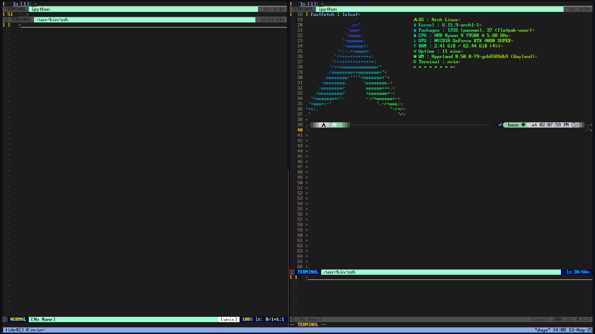
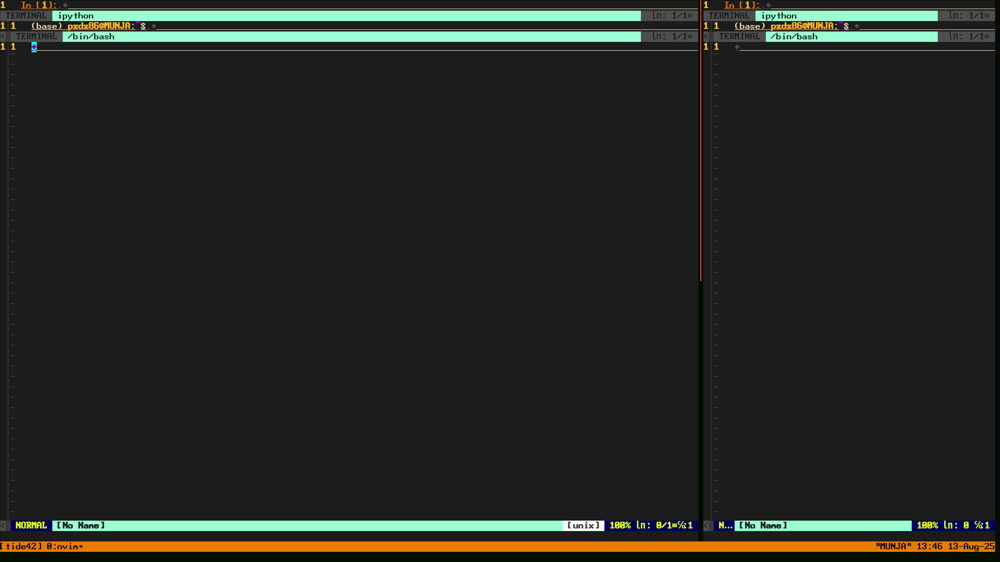
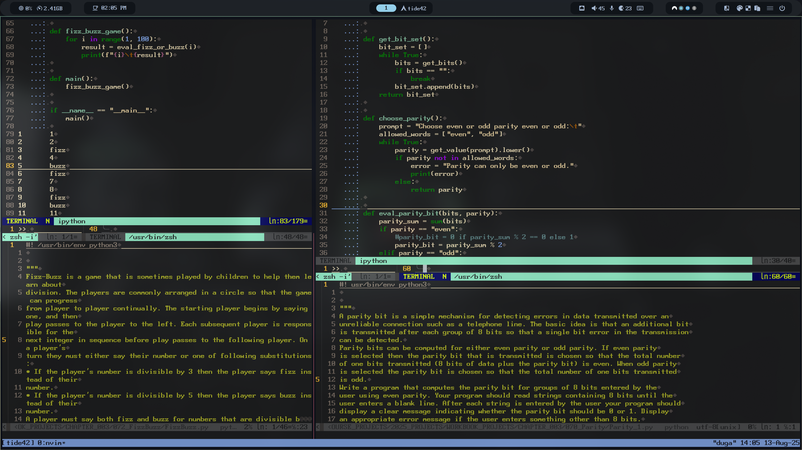
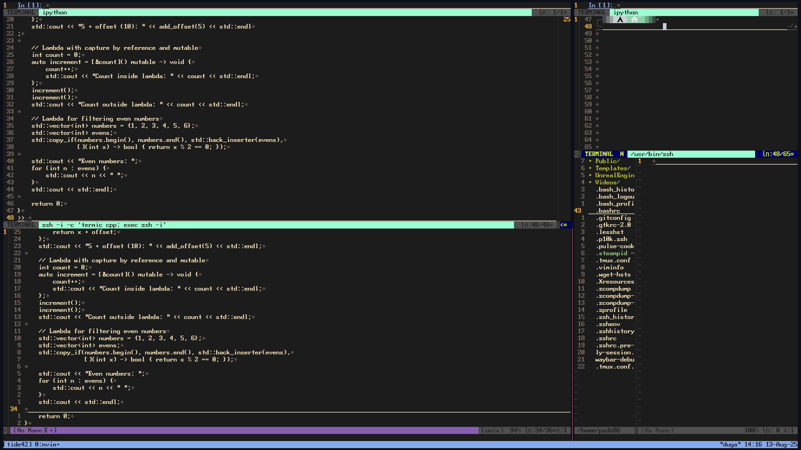
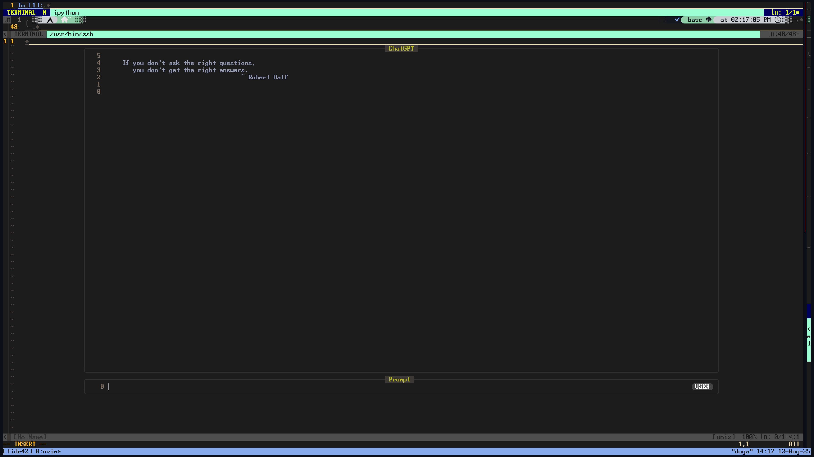
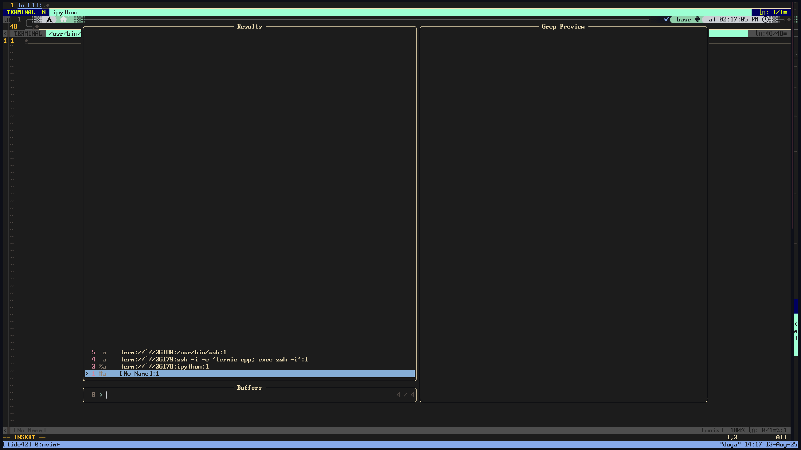
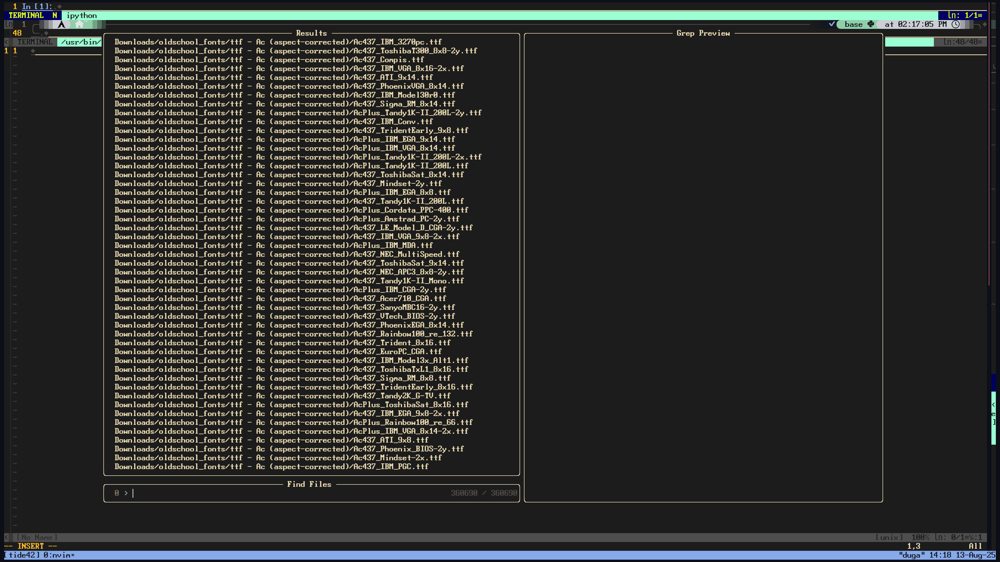
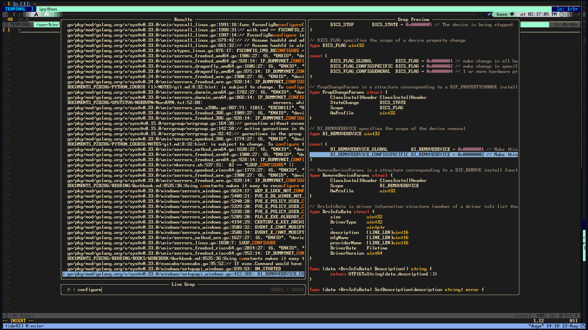
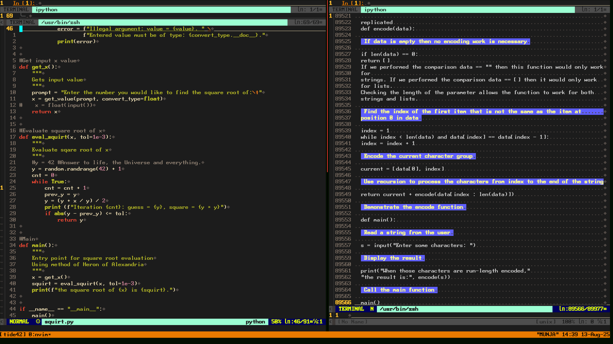
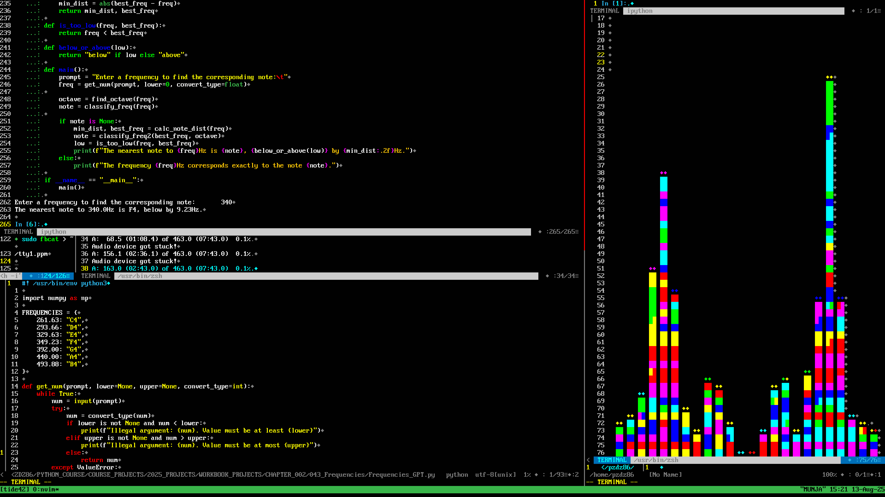

<pre><code>

                          ████████╗██╗██████╗ ███████╗██╗  ██╗██████╗ 
                          ╚══██╔══╝██║██╔══██╗██╔════╝██║  ██║╚════██╗
                             ██║   ██║██║  ██║█████╗  ███████║ █████╔╝
                             ██║   ██║██║  ██║██╔══╝  ╚════██║██╔═══╝ 
                             ██║   ██║██████╔╝███████╗     ██║███████╗
                             ╚═╝   ╚═╝╚═════╝ ╚══════╝     ╚═╝╚══════╝
                            Terminal Integrated Developer Environment 
                                               -42-                     

</code></pre>
## License

tide42 is licensed under the GNU General Public License v3.0 or later.  
See the [LICENSE](./LICENSE) file for full details.

## TermiC Support

tide42 includes `termic.sh`, a lightweight, interactive C/C++ environment launcher. It will be installed automatically to `/usr/local/bin/termic` unless it already exists.

This script is licensed under GPLv3 and included with permission.

## Terminal IDE 42:
An ultra-efficient Neovim based IDE for Python and C/C++ prototyping.
*Formerly known as Xtide86*

## Latest Version 
1.2.2

### Why the name?

Tide42 is inspired in part by *The Hitchhiker’s Guide to the Galaxy*, where "42" is famously revealed as the Answer to the Ultimate Question of Life, the Universe, and Everything. 

This project reflects that same spirit: a terminal IDE that encourages curiosity, simplicity, and discovery—*you ask the questions*. Tide42 is meant to be your solution, leaving the questions in your hands. 

<pre><code>
Ctrl/Ctrl+Alt|\
================
qw           | weryuiop
asdfg        | sfghl
zx           | zxcvbnm
</code></pre>
<pre><code>
                                          ███ ███ ███ ███                      
                                          ███████████████                    
                                      ███ ███████████████   ███                 
                                      █   ███████ ███████   █                
                                      █       ███████       █                 
                                  ██ ███ ██  ███ █ ███  ██ ███ ██             
                             ████ █████████  ████ ████  █████████    ████        
                             █    ████ ████  ███ █ ███  ████ ████    █        
                             █      █ █ █    █████████    █ █ █      █        
                         ██ ███ ██  ██ ███ █ █████████ █ ███ ██  ██ ███ ██   
                         █████████  ██████████       ██████████  █████████   
                         ████ ████  ████      █ ███ █      ████  ████ ████  
                          ██ █ ██   ████ ███████   ███████ ████   ██ █ ██    
                          ███ ███ █ ████  █      █      █  ████ █ ███ ███    
                          ████████████████ ███ █████ ███ ████████████████    
                          █████             ███████████             █████    
                          █████  █████████  ███     ███  █████████  █████    
                          ██  ████████████  ██  █ █  ██  ████████████  ██    
                          █████████  █████  █  ██ ██  █  █████  █████████    
                          █████████  █████  █         █  █████  █████████    
                         ██████████  █████  █  ██ ██  █  █████  ██████████    
                        ██████████████████   █  █   █  █   ████████████████
                                         █           █   █ █
                                          █   █         █ █ █
                                           █      █   █   █ █
                                            █           █ █ █
                                           █   █    █ █  █ █
                                          █             █ █
                                         █        █ █ █ █
</code></pre>

## Coming Soon!
- Opening second file in right tmux buffer if session is detached with a loaded file in the left (default).

## Flags
- Enable 88 color support (256 is default) with --low-color or -lc 
- Check version: --version
- Silence log: --quiet
- Help: --help
- Install location: --whereami
- Lite mode: --lite
- Low Color: --low-color, -lc
- Check for updates: --check-update
- Update: --update

## Controls

## Keyboard hotkey layout quick reference:

## Quit or Detach
Tmux based command: `Ctrl-q` + `d` (or gui exit button) = Exit and save tmux state (lost on restart of PC) 
Nvim based command `:Q` = Force-quit the program (reset for new session)
## Cycle nvim buffers within selected tmux buffer
`Ctrl+ww` = Cycle between vim buffers within a tmux buffer
## Manually select vim buffer within selected tmux buffer
`Ctrl+w` + <-, ^, ->, v = Selects vim buffer within current tmux buffer
## Restart IPython
`\n` = Restart IPython buffer if process exits.
## Fuzzy Finder
`\w` = fzf selects vim buffer from menu within current tmux buffer (fuzzy finder, vim plugin)
## Telescope
`\e` = Locate file within current directory
## Ripgrep
`\r` = ripgrep within file
## Toggle Colorscheme
`\y` = toggle between default and alternate colorscheme
## Quick vertical resize within horizontal nvim buffer
`\i` = vertical resize <NUMBER>
## Quick horizontal resize
`\u` = resize <NUMBER>
## AI
`\o` = optional OpenAI ChatGPT implementation with API key (stored in a global variable)
## Send to IPython
`\p` = Paste selected text into IPython buffer and expand buffer, entering insert mode.
## Send to TermiC
`\l` = Paste selected text into TermiC buffer and expand buffer, entering insert mode
## Append to Editor
`\m\` = Paste selected text into nvim file editor buffer from any buffer: terminal, ipython, or termic.

## Tmux buffer controls (work in insert or command mode)
##
`Ctrl+Alt+a` = Maximize left tmux buffer
##
`Ctrl+Alt+s` = Split tmux buffers
##
`Ctrl+Alt+d` = Maximize right tmux buffer
##
`Ctrl+Alt+z` = Push active buffer 25%
##
`Ctrl+Alt+x` = Push active buffer 30%
##
`Ctrl+Alt+c` = Push active buffer 60%
##
`Ctrl+Alt+v` = Push active buffer 75%
##
`Ctrl+q`  + <-, -> = Switch between tmux buffers (selected buffer matches tmux bar color on the bottom)

## Grid
##
`\f` = Grid (10x10)
##
`\g` = Grid (5x10)

## NeoVim buffer presets
##
`\z` = Maximize edit buffer or open Nerdtree on startup (lower)
`\s` = Maximize and enter TermiC buffer (left)
##
`\x` = Maximize and enter Terminal buffer(right)
##
`\c` = Maximize IPython buffer (upper)
##
`\v` = Currently selected buffer
##
`\b` = Display all buffers
##

## Additional NeoVim commands for ease of buffer management
##
`jk` = Command mode from nvim buffer
##
`:Hs` = Quick command for horizontal split

## Tips
##
- If you would like to map tide42 to a keyboard shortcut the best method is to use this command and substitute your terminal name: <gnome-terminal> -- bash -c "/usr/local/bin/tide42; exec bash"
- ggVG to select all when in nvim command mode followed by  \p or \l for efficient transfer of text into IPython or TermiC
- Once in insert mode in any ``nvim`` buffer, the recommended way of entering command mode is `jk`
- NERDTree may be refreshed with Shift+r after performing operations in the terminal buffer.
- All NeoVim commands can also be used in any other buffer eg. /Documents to find and jump to ~/Documents directory.
- Quickly enter focused and expanded file editor mode with Ctrl + Alt + A/D (make sure you are in the correct tmux buffer), \i + <Enter>
- Fine tune tmux buffer size with hold Ctrl + q + arrow keys.
- Open/close NERDTree with \z and \i + <Enter>
- Switch between tty sessions and retain tide42 session through tmux. Handy if connecting through SSH.
- If you're running tide42 inside a tmux or custom terminal session, you might run into issues when trying to save root-owned files from within Neovim:
Using commands like :w !sudo tee % in NeoVim may silently fail to prompt for a password and kick you out after 3 attempts.
Solutions:
Use a GUI editor instead within a tide42 terminal buffer to avoid leaving your session:
ex. sudoedit /etc/systemd/system/...
Launch a root nvim in a nested terminal within tide42:

## tide42 Remote SSH Session
##
Work remotely. Drop connection. Pick up exactly where you left off.
Instructions:
- ssh user@remotehost
- run tide42 and use any buffer for file transfers or processing.
- Do your work. Close the laptop. Disconnect. Go outside.
- ssh user@remotehost
- run tide42 to reconnect to tmux protected tide42 session.

## Features

- Full ``tmux`` and ``nvim`` '-powered terminal IDE with dynamic buffer management
- Seamless integration with ``IPython``
- ``TermiC`` support with quick pasting and testing C/C++ (smaller blocks recommended or lambda specific functions) see ``Termic`` 
  documentation at https://github.com/hanoglu/TermiC)
- Hotkey support for sending code directly into live interpreter sessions
- Single-interface fallback for simple edits
- Quick launch from Gnome via icon or keyboard shortcut
- Works in the tty as well as the terminal emulator

## Requirements

- ``tmux``
- ``neovim`` 0.9.0+ (tested on 0.9.5 and 0.12)
- ``vim-plug`` curl -fLo ~/.local/share/nvim/site/autoload/plug.vim --create-dirs \
https://raw.githubusercontent.com/junegunn/vim-plug/master/plug.vim 
- ``TermiC`` wget "https://raw.githubusercontent.com/hanoglu/TermiC/main/TermiC.sh"  (live C/C++ shell)
- ``Anaconda3`` with ``IPython`` (preferred, but may work with base ``IPython``)
- ``bash``
- Works on ARM. Tested on a Raspberry Pi5. Nvim 0.9.5 and 0.12 had to be built from source. Check your distro and dependencies on ARM. 

## Installation

# Preferred for updates:
:`bash`
- git clone https://github.com/logicmagix/tide42.git
- cd tide42

# Make the script executable (one-time setup)
- chmod +x install.sh
- ./install
- tide42 to start session

# If downloading .zip:
- Go to https://github.com/logicmagix/tide42 and click "Code" > "Download ZIP".
- Extract the ZIP to a directory (e.g., ~/tide42/).
- Run the installation script:
- cd ~/tide42/
- ./install.sh

## Updating tide42

# To update tide42 to the latest version, you must have a cloned Git repository.

- tide42 --update

## Notes:

- The sudo command may prompt for your password to modify /usr/local/bin.
- If you used a ZIP download, you cannot use tide42 --update unless you convert the directory to a Git repository.

## Usage
- Launch tide42 from your terminal or assigned launcher with tide42 or tide42 <FILENAME>. It will:

- Open a tmux session with vertically split nvim, TermiC, and IPython

- Send text from the file editor to the live interpreter buffer with ggVG(select all) \p for ipython and \l for TermiC

- Automatic insert mode and buffer sizing for paste to Termic and paste to IPython functions.

- Support session save (Ctrl+q+d) and reset with :Q

# Without tmux?
- Nvim and Tide42 now have seperate configurations. To run Tide42 without tmux, use the flag --lite.

# Customization
- See init.vim for plugin configuration, UI tweaks, and terminal behavior.
Feel free to remix buffer sizes and colors to match your workflow.

# TermiC Support
- tide42 includes termic.sh, a lightweight live shell.
It installs automatically to /usr/local/bin/termic.
Licensed under GPLv3 and included with permission.

Pull requests, stars, and forks welcome 

## Screenshots

- See tide42 in action:

### 	

### Tide42 and Nvim now have seperate configurations.

### Tide42 running bash X11

### Tide42 on Wayland/Integrated Ipython usage example

### Termic C/C++ Live Shell usage example

### AI prompt in Tide42 (requires API key)

### Search open buffers

### Search files

### Ripgrep search

### Study and Reference

### Tide42 works well in a minimal tty environment.

## Built With

tide42 uses and integrates the following open-source tools:
- [NeoVim](https://neovim.io/)
- [Vim](https://www.vim.org/)
- [tmux](https://github.com/tmux/tmux)
- [Anaconda3](https://www.anaconda.com/)
- [IPython](https://ipython.org/)
- [vim-plug](https://github.com/junegunn/vim-plug)
- [NERDTree](https://github.com/preservim/nerdtree)
- [TermiC](https://github.com/your-source-if-public-or-forked)

Thanks to the developers of these projects for making powerful tools free and accessible.

## Acknowledgments

-Made for the engineers who taught us, built by the ones they inspired.
- Thanks to my dad, whose passion for logic and engineering inspired this project.

 
